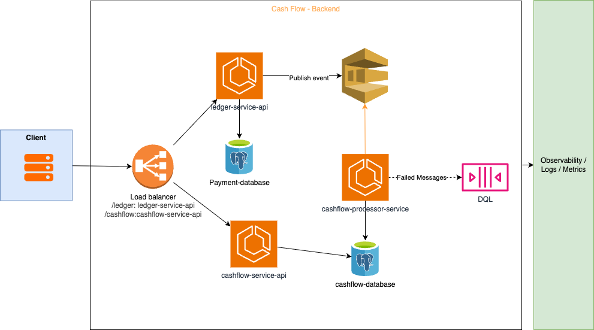

# Controle de fluxo de caixa diário

### Objetivo da Solução:

Serviços envolvidos criam a camada de negócios que possibilita lançamento financeiros de débito e créditos para comércio. A soma desses lançamentos gerarão o Fluxo de caixa da empresa, gerando relatórios de análise financeira em base diária, para detectar a saúde do comércio.

### Suposições / Limitações de escopo

- Como lançamento de Débito e Crédito, estou assumindo que são lançamentos financeiros (Contas a Pagar e Receber) baixados, ou seja, já se refere ao lançamento finalizado, não sendo necessário controle de "Pago: Sim/Não";
- Não vamos precisar lidar com outras moedas, somente real brasileiro
- Não preciso registrar qual o Caixa ou banco onde o lançamento foi realizado, somente o lançamento em sí.

### Requisitos de negócio da solução

- Possiblitar lançamentos de Débitos e Créditos financeiros para controle financeiro;
- Gerar fluxo de caixa diário a partir destes lançamentos
- Geração de relatório consolidado que disponibilize o saldo do fluxo de caixa diário

### Domínios funcionais e Capacidade do negócio

#### Domínios Funcionais

**Capacidades**

- Registrar lançamentos financeiros (Débito e Crédito);
- Cancelar lançamentos financeiros;
- Garantir idepotêmcia e rastreabilidade dos lançamentos;
- Processar cálculo de fluxo de caixa de forma assincrona
- Cálcular saldo diário consolidado;
- Disponibilizar consulta de saldo diário;

**Requisitos**

- **Funcionais**:
  - Deve permitir cadastramento lançamentos de créditos e débitos;
  - Para efeito de rastreabilidade, não deve ser possível excluir lançamentos, somente alterar o status do lançamento;
  - Estas serão as informações disponíveis em cada lançamento:

    - ID único do lançamento
    - Data do lançamento
    - Valor em Reais (R$)
    - Tipo de lançamento (Débido ou Crédito)
    - Id do documento original do lançamento (Idepotência)
    - Id do usuário do lançamento (Rastreabilidade)
    - Id do usuário de inativação (Rastreabilidade)
    - Status (Ativo / Inativo)
-
- **Não Funcionais**:
  - Deve garantir alta disponibilidade nos lançamentos;
  - Escrita transacional com idepotência;
  - Geração do fluxo de caixa não pode gerar indisponibilidade da gravação dos dados
  - Disponibilidade da leitura dos dados do Fluxo de Caixa deve ser independente da gravação dos dados

### Desenho da solução (Arquitetura alvo)

### Estimativa de Custos

#### Infraestrutura

#### Licenças/Assinaturas necessárias

### Monitoramento e Observabilidade

### Critérios de Segurança

## Mapa de Decisões

### Passo a passo do trabalho (Auto-organização)

1. [X] [Feito] **Requisitos de Negócio**: Inicio com criação do "Readme" do projeto, detalhando os requisitos de negócio.
2. [X] **Desenho da arquitetura inicial**: Do requisito de negócio, desenhar arquitetura inicial, considerando o requisito nõa funcional de requisições.
3. [X] **Validação inicial de requisitos**: Revisar arquitetura com base nos requisitos obrigatórios do exercício e diferenciais;
4. [ ] Escolha da linguagem;
   1. [ ] Documentar motivador da escolha.
5. [ ] Criar estrutura base dos serviços e stack de testes;
6. [ ] Desenvolvimento das soluções
7. [ ] Revisão do fluxo

### Decisões de Arquitetura

1. **Serviços necessários**: No processo de criação da arquitetura e levando em conta a quantidade de requisições que o negócio exige, optei por separar as responsabilidades em três serviços com responsabilidades bem definidas:

| Serviço                   | Responsabilidade                                                                                                                                                                                                                                            |
| :--------------------------- | ------------------------------------------------------------------------------------------------------------------------------------------------------------------------------------------------------------------------------------------------------------- |
| ledger-service-api         | Gravação dos dados de lançamentos financeiros, considerando idepotência transacional, postando resultado em fila após o final da gravação;                                                                                                           |
| cashflow-processor-service | Leitura assincrona da fila de lançamentos financeiros; Serviço será responsável por qualquer cálculo extra necessário no momento da criação dos registros que vão compor o fluxo de caixa. Este serviço não recebe chamadas de outros serviços; |
| cashflow-service-api       | Somente Leitura: responsável por ler os dados pré-calculados do fluxo de caixa e devolter ao usuário                                                                                                                                                     |

2. **Escolha do banco de dados**: Optei por banco relacional (PostGreSql) tanto para gravação inicial dos dados quanto do Fluxo de caixa, entendendo que:
   1. Dados financeiros são críticos, demandam que o armazenamento também garanta integridade transacional das informações;
   2. Postgresql atende o requisito de volume esperado tanto de gravações e leituras por segundo;
   3. A escalabilidade horizontal dos serviços garante que o processamento pelos serviços não serão o gargalo técnico das operações
3. **Escolha da Linguagem**: Para o exercício optei pelo Node.js com Typescript, pela simplicidade de codificação da linguagem, mas também considerando ser uma linguagem
   1. Amplamente difundida no mercado e com baixa curva de aprendizado, facilitando recrutamento de desenvolvedores;
   2. Grande comunidade ativa, facilitando a obtenção de pacotes e frameworks;
   3. Problema e solução propostos focam em I/O, sem cálculos complexos;
   4. Entrega performace suficiente para atendimento dos requisitos de negócio, mesmo em produção;

Ponto de Atenção: Não considerei para esta avaliação a

**Alternativas Avaliadas**:

- **Clojure (Java)**: Atende os requisitos do exercício em um cenário produtivo estruturamente indicada em cenários de cálculos em ****memória e alto paralelismo, podendo ser uma excelente escolha dependendo do restante da arquitetura da solução, principalmente para o cashflow-processor-service;
- **Rust**: Curva de aprendizado complexa, além de ser necessários controles de estado de alta complexidade; Meu disgnóstico é que é uma solução mais robusta e complexa do que o cenário de negócio exige

## Detalhamento técnico

### Instalação e Configuração

#### Ferramentas Utilizadas

* IDE: Visual Studio Code for Mac com os complementos:
  * vscode-pdf - Visualização do PDF do exercício
  * Markdown Editor - Edição do Readme do projeto
  * "*Draw.io Integration created by Henning Dieterichs*" - Criação e Visualização dos diagramas do projeto

#### Variáveis de Ambiente

#### Executando o projeto

Instalação de dependências

{code}
